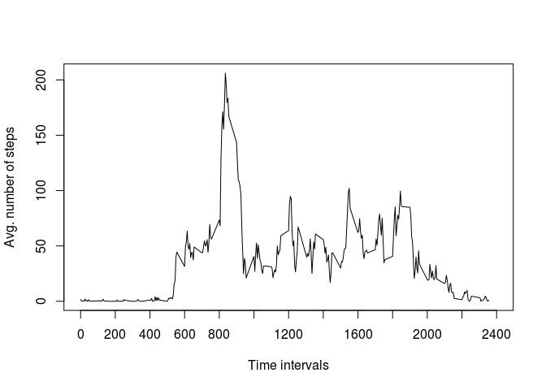

# Reproducible Research: Peer Assessment 1


## Loading and preprocessing the data
###Show any code that is needed to
####1. Load the data (i.e. read.csv())
####2. Process/transform the data (if necessary) into a format suitable for your analysis

###I'm presuming the activity.zip file is present in the current working directory

```r
unzip("activity.zip")
dataset <- read.csv("activity.csv")
```

## What is mean total number of steps taken per day?
###For this part of the assignment, you can ignore the missing values in the dataset.
####1. Make a histogram of the total number of steps taken each day
####2. Calculate and report the mean and median total number of steps taken per day

###1:

```r
#Finding the aggregated number of steps pr. day
ag.steps.pr.day <- aggregate(steps ~ date, dataset, sum)
#Plotting the histogram using the lattice package
library(lattice)
histogram(ag.steps.pr.day$steps, xlab = "Aggregated number of steps pr. day", ylab = "Frequency of observations", nint = 21)
```


###2:

```r
#Finding the mean and median of aggregated steps per day
ds1mean <- mean(ag.steps.pr.day$steps)
ds1median <- median(ag.steps.pr.day$steps)
ds1mean
```

```
## [1] 10766.19
```

```r
ds1median
```

```
## [1] 10765
```


## What is the average daily activity pattern?
####1. Make a time series plot (i.e. type = "l") of the 5-minute interval (x-axis)
####and the average number of steps taken, averaged across all days (y-axis)
####2. Which 5-minute interval, on average across all the days in the dataset,
####contains the maximum number of steps?
###1:

```r
#Finding the mean aggregated number of steps per interval
mag.steps.pr.interval <- aggregate(steps ~ interval, dataset, mean)
```
###1.1:

```r
#Plotting a time series graph of the result
plot(mag.steps.pr.interval$interval, mag.steps.pr.interval$steps, type = "l", ylab = "Avg. number of steps", xlab = "Time intervals", xlim = c(0, 2400), lab = c(12,4,0))
```



###2:

```r
#Which interval contains the highest average number of steps
maxint <- mag.steps.pr.interval[which.max(mag.steps.pr.interval$steps),]
maxint[,1]
```

```
## [1] 835
```

## Imputing missing values
###Note that there are a number of days/intervals where there are missing values
###(coded as NA). The presence of missing days may introduce bias into some
###calculations or summaries of the data.
####1. Calculate and report the total number of missing values in the dataset
####(i.e. the total number of rows with NAs)
####2. Devise a strategy for filling in all of the missing values in the dataset. The
####strategy does not need to be sophisticated. For example, you could use
####the mean/median for that day, or the mean for that 5-minute interval, etc.
####3. Create a new dataset that is equal to the original dataset but with the
####missing data filled in.
####4. Make a histogram of the total number of steps taken each day and Calculate
####and report the mean and median total number of steps taken per day. Do
####these values differ from the estimates from the first part of the assignment?
####What is the impact of imputing missing data on the estimates of the total
####daily number of steps?
###1:

```r
#How many row in the original dataset contains NA-values
sum(is.na(dataset$steps))
```

```
## [1] 2304
```

```r
#This could also have been found by the use of the summary() function
```
###2:
####The reason for missing values could be any...
####Forgot to wear the gadget, no batteries, any other kind of issues
####So in order to fill them in several approaches could be selected
####Fill the missing with day-averages, or interval averages or any other kind of approaches
####We could also use the mice package which includes several different ways to do this
####I've decided to use the default "ppm" (predictive mean matching) with default iterations based on the assumption that the reason for the missing values a of technical reasons, and that the person has worn the gadget throughout the test-periode.

```r
#Loading the mice package
library(mice)
```

```
## Loading required package: Rcpp
```

```
## mice 2.25 2015-11-09
```

```r
#Imputing the dataset
tempdata <- mice(dataset)
```

```
## 
##  iter imp variable
##   1   1  steps
##   1   2  steps
##   1   3  steps
##   1   4  steps
##   1   5  steps
##   2   1  steps
##   2   2  steps
##   2   3  steps
##   2   4  steps
##   2   5  steps
##   3   1  steps
##   3   2  steps
##   3   3  steps
##   3   4  steps
##   3   5  steps
##   4   1  steps
##   4   2  steps
##   4   3  steps
##   4   4  steps
##   4   5  steps
##   5   1  steps
##   5   2  steps
##   5   3  steps
##   5   4  steps
##   5   5  steps
```
###3:

```r
imputedData <- complete(tempdata, 1)
```
###4:

```r
#Finding the aggregated number of steps pr. day in the imputed dataset
ag.steps.pr.day.2 <- aggregate(steps ~ date, imputedData, sum)
#Histogram of the imputed dataset
histogram(ag.steps.pr.day.2$steps, xlab = "Aggregated number of steps pr. day", ylab = "Frequency of observations", nint = 21)
```


```r
#Finding the mean and median of aggregated steps per day on the imputed dataset
ds2mean <- mean(ag.steps.pr.day.2$steps)
ds2median <- median(ag.steps.pr.day.2$steps)
ds2mean
```

```
## [1] 11141.38
```

```r
ds2median
```

```
## [1] 11352
```

```r
meandiff <- ds2mean - ds1mean
mediandiff <- ds2median - ds1median
meandiff
```

```
## [1] 375.1884
```

```r
mediandiff
```

```
## [1] 587
```

####As expected the median is close to the same, the mean is of course different, as we have replaced 2304 missing values which results in larger data set, and the mean is dependent of not only the amount of observations but also the size of each value it self.

## Are there differences in activity patterns between weekdays and weekends?
###For this part the weekdays() function may be of some help here. Use the dataset
###with the filled-in missing values for this part.
####1. Create a new factor variable in the dataset with two levels – “weekday”
####and “weekend” indicating whether a given date is a weekday or weekend day.
####2. Make a panel plot containing a time series plot (i.e. type = "l") of the
####5-minute interval (x-axis) and the average number of steps taken, averaged
####across all weekday days or weekend days (y-axis).
###1:

```r
#First we'll create a factor variable of daytypes
daytype <- weekdays(as.Date(imputedData$date))
#Now replace all workingdays to the string "weekday"
daytype <- replace(daytype, daytype %in% list("Monday", "Tuesday", "Wednesday", "Thursday", "Friday"), "weekday")
#The same for weekends
daytype <- replace(daytype, daytype %in% list("Saturday", "Sunday"), "weekend")
#And glue it together with the imputed dataset
imputedData <- cbind(imputedData, daytype)
#We now have a dataset to analyse
```

```r
#lets again find the mean of aggregated steps per interval
mag.steps.pr.interval.2 <- aggregate(steps ~ interval + daytype, imputedData, mean)
#Plotting a time series graph of the result
xyplot(mag.steps.pr.interval.2$steps ~ mag.steps.pr.interval.2$interval | daytype, data=mag.steps.pr.interval.2, type = "l", layout=c(1,2), xlab = "Intervals", ylab = "Aggr. number of steps")
```


####We can clearly see a different pattern during weekends. Weekdays tend to have a peak around 0800 to 1000, whereas during weekends the number of steps seems to be more spread out all through the day.

